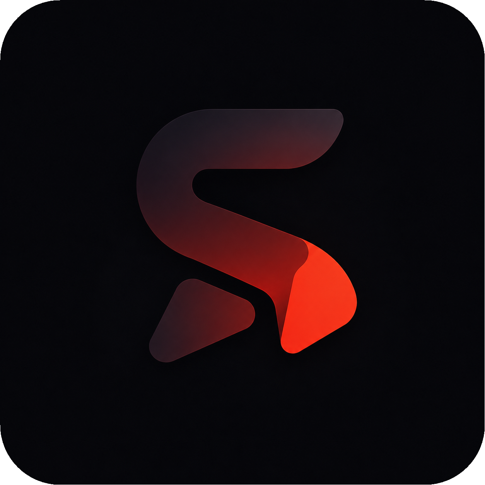

<div align="center">
  

  <h1>Savewave</h1>

  <p><strong>Private by design · No accounts · No database · Public media resolver and downloader</strong></p>
  <p><em>Designed &amp; Developed by <a href="https://kuberbassi.com">Kuber Bassi</a></em></p>

  <p><a href="https://savewave.kuberbassi.com/"><strong>⚡ Open Live Web Application »</strong></a></p>

  <p>
    
    
    
    
    
    
  </p>
</div>

---

Savewave is a privacy-focused public-media resolver and downloader built with React, Express, `yt-dlp`, and Vitest. It follows one focused flow: **Paste → Resolve → Preview → Save**.

## Tech architecture

| Technology | Role in Savewave |
| :--- | :--- |
| React 18 | Component-based frontend, responsive tabs, media previews, progress states, local history, and the complete paste-to-save user flow. |
| JavaScript + Babel | JSX application source and production browser compilation without introducing a larger frontend framework. |
| Tailwind CSS + modular CSS | Utility generation, design tokens, reusable component styles, responsive layouts, themes, motion, and accessibility states. |
| Node.js 20+ | Server runtime for link validation, source detection, media resolution, streaming, and download preparation. |
| Express 4 | Lightweight HTTP server, JSON API endpoints, static frontend delivery, request limits, security headers, and download routes. |
| yt-dlp | Public-media extraction and format discovery for supported video, audio, and social platforms. |
| Spotify Smart Match | Deterministic title, artist, duration, version, source-authenticity, and ambiguity scoring against public audio candidates. |
| Undici | Restricted outbound HTTP requests with connection controls and SSRF-safe URL validation. |
| Browser localStorage | Device-only, bounded download history with no account, database, or cloud synchronization. |
| Vitest + Supertest | Unit and integration coverage for resolvers, security rules, API behavior, SEO files, and provider reliability. |
| Vercel | Production hosting, Express routing, static asset delivery, and deployment configuration. |

```text
React interface
    → Express API
        → URL validation and platform detection
            → Platform resolver / Spotify Smart Match
                → Verified public media source
                    → Preview → Save
```

Savewave intentionally uses React with a small Express backend; it is **not a Next.js application**. This keeps the architecture direct, understandable, and easy to maintain.

## What it supports

| Platform | Supported public media |
| :--- | :--- |
| YouTube | Videos, Shorts, and audio |
| Instagram | Reels, posts, photos, videos, and carousels |
| Facebook | Videos, Reels, and post media |
| Threads | Post videos and images |
| X / Twitter | Videos and images |
| SoundCloud | Audio streams |
| Spotify | Metadata plus strict audio-source matching |
| Direct URLs | Common video, audio, and image formats |

Private, login-gated, and Story media is intentionally rejected. Savewave does not accept cookies or browser sessions. Platform support can change when a source changes its public delivery system.

## Privacy model

- No account or application database.
- No permanent server-side media storage.
- Bounded download history stored locally in the browser's local storage.
- Final download targets are validated before the browser opens them.

## Spotify matching

Savewave does not download audio from Spotify. It reads the public Spotify embed metadata—including canonical artists, precise duration, release information, availability, and artwork—then searches public audio sources in parallel. Candidates are ranked using title coverage, every credited artist, duration, version markers, channel authenticity, explicit/clean compatibility, and ambiguity checks. A result is returned only above a strict confidence threshold. No Spotify API key or Premium account is required.

## Local development

Requirements: Node.js 20 or newer, npm, and a working `yt-dlp` runtime.

```bash
npm install
npm run build
npm test
npm start
```

Open `http://localhost:3000`.

## Project structure

```text
public/
  app.jsx          React interface source
  app.js           compiled browser bundle
  style.css        components, motion, and responsive rules
  theme.css        design tokens and theme foundations
src/services/
  resolver/        source detection, providers, validation, and normalization
tests/
  integration/     API behavior
  unit/            resolver, security, SEO, and provider behavior
server.js           Express application and download endpoints
```

`public/app.js` and `public/dist.css` are deployable build artifacts and should be regenerated after changing their source files.

## Commands

- `npm start` - start the Express application.
- `npm run build` - rebuild production CSS and JavaScript.
- `npm test` - run the complete Vitest suite.

## Responsible use

Only download media you are authorized to save. You are responsible for following source terms and applicable law.

## Security and contributing

See [SECURITY.md](SECURITY.md) for private vulnerability reporting and [CONTRIBUTING.md](CONTRIBUTING.md) for development guidelines.

## License

[MIT License](LICENSE) (c) 2026 Savewave / [Kuber Bassi](https://kuberbassi.com)
