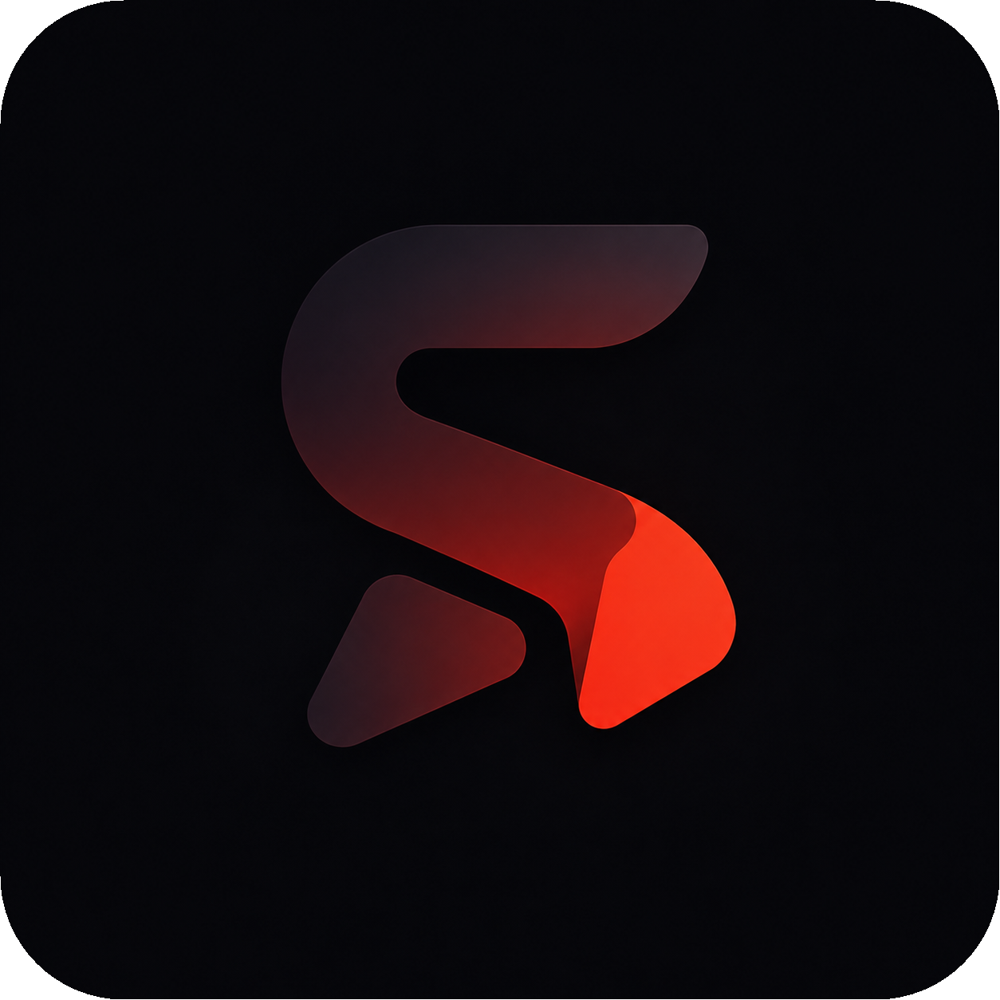

<div align="center">
  

  # Savewave

  **Paste → Resolve → Preview → Save**

  A privacy-focused media saver for public video, audio, and image links running entirely on your device.

  [Official Website](https://savewave.kuberbassi.com/) · [Changelog](CHANGELOG.md) · [Maintenance Guide](docs/MAINTENANCE.md) · [License](LICENSE)

  
  
  
  
  
</div>

---

## Overview

Savewave is a clean, local-first media downloader. It automatically detects media sources, extracts best-available quality streams, and saves them directly to your device without accounts, cloud processing, or server uploads.

- **Local Processing**: Extraction runs on-device via bundled `yt-dlp` and `FFmpeg`.
- **Zero Cloud Storage**: No remote user database, account system, or media proxies.
- **Public Content Only**: Savewave v1.0.14 supports public YouTube, individual public Instagram Reels, SoundCloud, direct media links, and Spotify Smart Match. Instagram posts/Stories, Facebook, and X/Twitter are not supported; private, login-gated, or DRM media is also unsupported. Installed Android Reel transfers still need real-device confirmation.

---

## Tech Stack & Architecture

| Layer | Technologies | Responsibility |
| --- | --- | --- |
| **Frontend UI** | React 18, Tailwind CSS | Responsive Paste → Preview → Save interface |
| **Core Logic** | TypeScript, Vitest | Source detection, capability gates, error handling, Spotify match scoring |
| **Desktop App** | Electron, Node.js | Isolated IPC, bundled engines, native saving, verified GitHub updates |
| **Media Engine** | `yt-dlp`, `FFmpeg` | Local public media extraction and stream remuxing |
| **Android App** | Capacitor, small Java bridge, `youtubedl-android` | Native engine and scoped `MediaStore` saving |

---

## Development Setup

### Prerequisites
- Node.js `22+`
- Android Studio and Java 21 for APK builds

### Quick Start

```bash
# 1. Install dependencies
npm install

# 2. Run typecheck & test suite
npm run check

# 3. Download local sidecars & launch desktop app in dev mode
npm run prepare:sidecars
npm run electron:dev
```

### Useful Commands

```bash
# Run test suite
npm test

# Build production desktop installer
npm run electron:pack -- --publish never

# Sync the Android project, then build its APK in android/
npm run capacitor:sync
```

---

## Documentation

- 🏗️ [Architecture](docs/ARCHITECTURE.md) — System boundaries and lifecycle
- ⚙️ [Media Engine Rules](docs/MEDIA_ENGINE.md) — Source detection and extraction policy
- 🛠️ [Maintenance & Updates](docs/MAINTENANCE.md) — Tracking `yt-dlp` upstream updates
- 🚀 [Release Process](docs/RELEASING.md) — Releasing desktop and mobile builds
- ✅ [Release Checklist](docs/RELEASE_CHECKLIST.md) — Version files, platform tests, artifacts, and publication checks

---

## Developer & Author

Created and maintained by **Kuber Bassi** ([kuberbassi.com](https://kuberbassi.com/) · [@kuberbassi](https://github.com/kuberbassi) · [LinkedIn](https://linkedin.com/in/kuberbassi)).

---

## License

[MIT](LICENSE) © Kuber Bassi.
